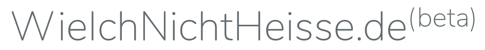

## [WieIchNichtHeisse.de](https://wieichnichtheisse.de)(beta)

WieIchNichtHeisse.de entstand durch einen Tweet von [Oğuz Yılmaz](https://twitter.com/oguz/status/1244634877452070912) und ist ein nicht kommerzielles Communityprojekt, um Menschen zu helfen deren Namen regelmäßig falsch geschrieben werden. 

## Mithelfen

Falls du mithelfen möchtest, erstelle ein Issue oder einen Pull Request. Ich bin für jede hilfe dankbar! :) 
## Code of Conduct

Um sicher zu stellen, dass dieses Projekt offen für so viele Menschen wie möglich ist, halte dich bitte an den [Code of Conduct](https://queer-code.org/coc.html) des Queer Codes.

## Lizenz

Der Code von WieIchNichtheisse.de ist open-source unter der [MIT Lizenz](https://opensource.org/licenses/MIT).
